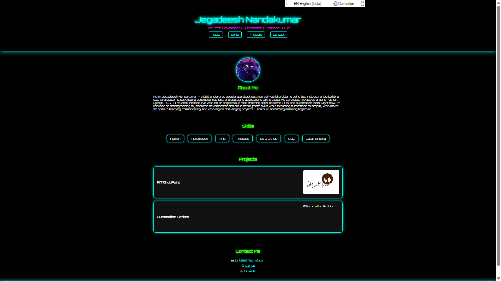

# 🔥 Jegadeesh (Jack) Nandakumar — Portfolio Website

A Neon-themed (CyberPunk Vibe) personal portfolio website showcasing my skills in **Backend Development, Automation, APIs, and Firebase**.

## 🚀 Tech Stack

- 🐍 Python
- ☁️ Firebase (Firestore, Authentication)
- 🔗 APIs (REST)
- 💻 HTML, CSS (Neon Cyberpunk theme)
- 🛠️ Git & GitHub

## 📜 Sections

- **About Me** — Short intro & profile  
- **Skills** — My current tech stack  
- **Projects** — With images and hover descriptions  
- **Contact** — Email, GitHub, LinkedIn links  

## 📸 Preview



## 🔥 How to Run Locally

1. **Clone this repository:**
```bash
git clone https://github.com/Jxck-007/portfolio.git
